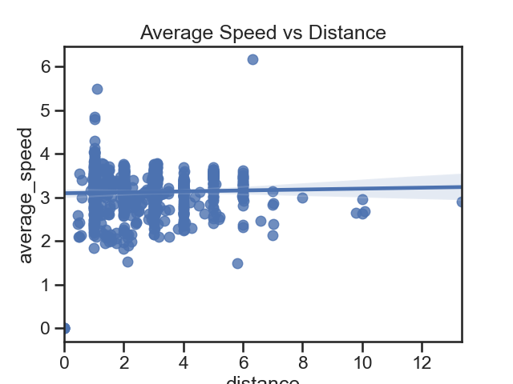
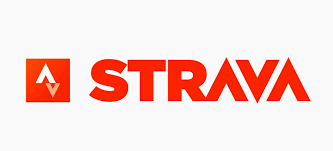

<!--
*** Thanks for checking out the Best-README-Template. If you have a suggestion
*** that would make this better, please fork the repo and create a pull request
*** or simply open an issue with the tag "enhancement".
*** Thanks again! Now go create something AMAZING! :D
-->


<!-- PROJECT SHIELDS -->
<!--
*** I'm using markdown "reference style" links for readability.
*** Reference links are enclosed in brackets [ ] instead of parentheses ( ).
*** See the bottom of this document for the declaration of the reference variables
*** for contributors-url, forks-url, etc. This is an optional, concise syntax you may use.
*** https://www.markdownguide.org/basic-syntax/#reference-style-links
-->

[![MIT License][license-shield]][license-url]
[![LinkedIn][linkedin-shield]][linkedin-url]


<!-- PROJECT LOGO -->
<br />

<p align="center">
  <a href="https://anna-koretchko.ue.r.appspot.com">
    
  </a>

  <h3 align="center">Strava Running Analysis</h3>

  <p align="center">
    Created this package as a way to implement the Strava API to automatically get my running data. Additionally, performed some Machine Learning Models are my data!
    <br />
    <a href="https://connect.garmin.com/"><strong>Strava »</strong></a>
    <br />
    <br />
    <a href="https://github.com/annakoretchko/strava_analysis/tree/master/dist/lastest_build">Latest Package</a>
    ·
    <a href="https://anna-koretchko.ue.r.appspot.com">Demo</a>
    ·
    <a href="https://developers.strava.com/">Strava API Documentation</a>
    ·
  </p>
</p>


<!-- TABLE OF CONTENTS -->
<details open="open">
  <summary>Table of Contents</summary>
  <ol>
    <li>
      <a href="#about-the-project">About The Project</a>
      <ul>
        <li><a href="#built-with">Built With</a></li>
      </ul>
    </li>
    <li>
      <a href="#getting-started">Getting Started</a>
      <ul>
        <li><a href="#prerequisites">Prerequisites</a></li>
        <li><a href="#installation-and-example-run">Installation and Example Run</a></li>
      </ul>
    </li>
    <li><a href="#usage">Usage</a></li>
    <li><a href="#license">License</a></li>
    <li><a href="#contact">Contact</a></li>
  </ol>
</details>


<!-- ABOUT THE PROJECT -->
## About The Project
<p align="center">
 
</p>

I have been using Strava *since 2014*, and for those of you unfamiliar with what Strava is, it's essentially 
a social media for runners, bikers and swimmers alike. A platform where equally obsessed athletes can gather and
ogle over their exercise data.  

I have been collecting running, swimming, lifting, and social media data surrounding my exercise efforts for the past  *7 years*, so I figured it was time to start doing some analytics ont he data. And sharing my methods and approach with you!  
<br />
<br />

This project I will be going through the following:

  1. Provide a method to gather your most recent Strava data automatically, using python, via Strava's API
  2. Gather your historic Strava data through their site
  3. Clean and join the new and historic data 
  4. Start exploring my data and asking serious questions, like, can we predict the number of kudos I will receive on my next run by how many pictures I post? 
  5. But seriously, doing some cool Machine Learning, simple stats and other fun math to interpret our data!
<br />


* If you wanna try on your own but don't have a Strava account, feel free to use the demo-data in the data folder!

* If you wanna sign up for Strava and start collecting your own data, you can sign up [here](https://www.strava.com/register/free). It's **FREE**!


### Built With

This project is built using the following: 
* [Python](https://www.python.org/)
* [jupyter notebook](https://jupyter.org/)
* [Strava API](https://developers.strava.com/)


Also special thanks to Francis Polignano who provided some key [YouTube videos](https://www.youtube.com/watch?v=sgscChKfGyg) and [repos](https://github.com/franchyze923/Code_From_Tutorials/tree/master/Strava_Api) explaining how to work with Strava's API.

<!-- GETTING STARTED -->
## Getting Started

### Prerequisites

Python is the only technical requirement for this project (however, environment managers such as conda are greatly suggested as well)
* python
  ```sh
  sudo apt-get install python3.6
  ```

Additionally, there are **two** sources of data I employ for this project: 

1. One I call call *historic* data, and is all my Strava data from the moment I request. This is gathering the data in bulk, since the Strava API limits you to your 200 most recent posts (which doesn't cover much if you've been using it for 7 years).  
* If you have a Strava account, to get your *historic* data, go [here](https://support.strava.com/hc/en-us/articles/216918437-Exporting-your-Data-and-Bulk-Export)

2. The other I call *new* data, and it is employs Strava API to get your most recent activities. The way this program runs, it uses your *historic* data, runs and API request to get your *new* data, and combines the two. To use the Strava API, you will need the following:
* Client Key
* Client Secret
* Refresh Token  

If all of these words are foreign to you, that is ok. Thankfully, Francis Polignano was kind enough to provide a [video](https://www.youtube.com/watch?v=sgscChKfGyg) going through this process. My code follows the steps he took, so you can successfully combine your newest and oldest data to one fantastic source of running data!

### Installation and Example Run

Once you have the necessary keys discussed above, you're ready to cooking!  

1. Create conda environment for strava_analysis project ([install conda Here](https://conda.io/projects/conda/en/latest/user-guide/install/index.html))

2. Download the latest wheel (whl) from from the dist folder [here](https://github.com/annakoretchko/strava_analysis/tree/master/dist/lastest_build)

3. cd to the downloaded wheel file
   ```sh
   (strava_env) cd Downloads/strava_analysis-0.X-py3-none-any.whl
   ```
4. pip install `strava_analysis-0.X-py3-none-any.whl` to your newly created conda environment
   ```sh
   (strava_env) pip install garmin_analysis-0.X-py3-none-any.whl
   ```
5. Now run the package which requires two inputs: -data and -output_path 
    ```sh
    (strava_env) python -m strava_analysis 
    ```

That'll complete getting your historic data, using the API to get the newest data, cleaning and combining them, and creating basic graphs and analysis for it.  

To further explore my data, I turn to jupyter notebooks as they provide an simpler way to have a walkthrough with graphs and images.  

Please refer to [jupyter_visuals](https://github.com/annakoretchko/strava_analysis/tree/master/strava_analysis/jupyter_visuals) and simply replace the output from the previous steps as the csv used here to explore your data!  

<!-- USAGE EXAMPLES -->
## Usage

This packages allows Strava users to analyze their data in a pythonic manner, which can be extrapolated further into a myriad of projects! It employs Strava's API to access your data and this allows you to run is systematically as you keep on running and gathering more data!  

_To see a live demo of the graphs/outputs, please refer to the [Demo](https://anna-koretchko.ue.r.appspot.com)_


<!-- LICENSE -->
## License

Distributed under the MIT License. See `LICENSE` for more information.


<!-- CONTACT -->
## Contact

* Anna Koretchko - [Personal Website](https://anna-koretchko.ue.r.appspot.com/index)
* Email - annakoretchko@gmail.com


<!-- MARKDOWN LINKS & IMAGES -->
<!-- https://www.markdownguide.org/basic-syntax/#reference-style-links -->
[contributors-shield]: https://img.shields.io/github/contributors/othneildrew/Best-README-Template.svg?style=for-the-badge
[contributors-url]: https://github.com/othneildrew/Best-README-Template/graphs/contributors
[forks-shield]: https://img.shields.io/github/forks/othneildrew/Best-README-Template.svg?style=for-the-badge
[forks-url]: https://github.com/othneildrew/Best-README-Template/network/members
[stars-shield]: https://img.shields.io/github/stars/othneildrew/Best-README-Template.svg?style=for-the-badge
[stars-url]: https://github.com/othneildrew/Best-README-Template/stargazers
[issues-shield]: https://img.shields.io/github/issues/othneildrew/Best-README-Template.svg?style=for-the-badge
[issues-url]: https://github.com/othneildrew/Best-README-Template/issues
[license-shield]: https://img.shields.io/github/license/othneildrew/Best-README-Template.svg?style=for-the-badge
[license-url]: https://github.com/annakoretchko/garmin_analysis/blob/master/LICENSE
[linkedin-shield]: https://img.shields.io/badge/-LinkedIn-black.svg?style=for-the-badge&logo=linkedin&colorB=555
[linkedin-url]: https://www.linkedin.com/in/anna-koretchko-1b5b0211a/
[product-screenshot]: images/screenshot.png

